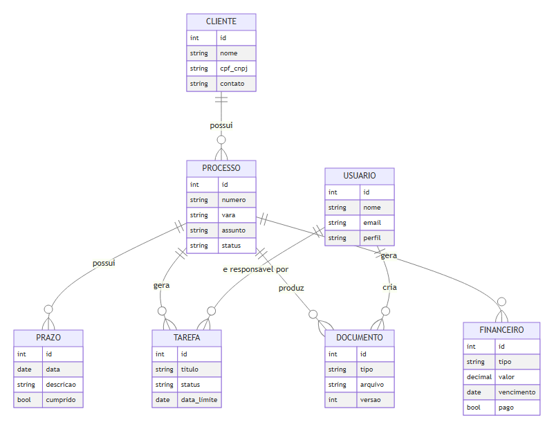
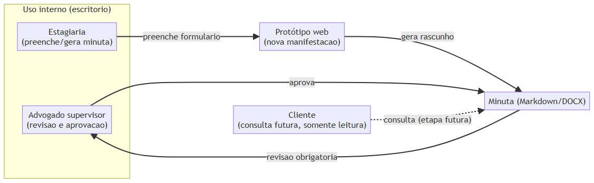

# ATA 001 — Reunião inicial e definição do primeiro incremento

**Data:** 08/06/2026  
**Projeto:** Plataforma local de gestão jurídica e automação assistida  
**Participantes:** Contratante/advogado; estagiário de Engenharia de Software (IA assistida)  
**Status:** Em aberto, aguardando validações e respostas complementares

## 1. Objetivo informado pelo contratante

Desenvolver uma automação assistida por advogado para auxiliar na criação de petições simples relacionadas ao cumprimento de prazos processuais. A automação deverá apoiar o trabalho jurídico, mas o conteúdo deverá ser revisado e aprovado por advogado antes de qualquer uso ou protocolo.

## 2. Primeira entrega definida

A primeira entrega será o layout de um novo site, utilizando como referência as cores do modelo DOCX timbrado do escritório. O arquivo do modelo ainda deverá ser disponibilizado para extração das cores e demais elementos visuais.

## 3. Usuários iniciais

- Mauro Junior Parpinelli — OAB/PR 84.908
- Patricia Karin Gasparotto — OAB/PR 57.659

O acesso inicial será restrito aos dois advogados. Outros perfis poderão ser analisados em etapa futura.

## 4. Dados mínimos inicialmente identificados

- parte representada pelo advogado (cliente);
- número do processo;
- informações necessárias ao cumprimento do prazo e à elaboração da petição, a serem detalhadas na fase de requisitos.

O controle atual de prazos é realizado em sistema separado desenvolvido pelo contratante. A integração com esse sistema não faz parte da primeira entrega e deverá ser especificada posteriormente.

## 5. Ambiente definido

- **Hospedagem:** ambiente local.
- **Raiz do servidor:** `C:\\inetpub\\wwwroot`.
- **Primeira fase:** layout e organização do site, sem alteração de dados reais.

## 6. Estágio

O contratante informou que acredita que o estágio seja obrigatório, mas essa informação ainda precisa ser confirmada com a UTFPR. Foi informada disponibilidade de 6 horas diárias, devendo ser confirmados dias da semana, duração, data de início e demais condições formais.

## 7. Perguntas solicitadas pelo estagiário

1. Qual é o modelo DOCX timbrado que servirá de referência visual? Favor disponibilizar uma cópia sem dados pessoais ou sigilosos, se possível.
2. Quais tipos de petições simples devem ser priorizados no primeiro protótipo?
3. Quais campos, documentos e informações o advogado consulta antes de redigir cada tipo de petição?
4. O site deverá apenas gerar um rascunho ou também salvar versões, histórico e documentos?
5. Qual fluxo de revisão e aprovação será obrigatório antes de exportar ou utilizar uma petição?
6. Como o sistema separado de prazos poderá fornecer dados: banco, arquivo, API ou lançamento manual?
7. O servidor local terá banco de dados, HTTPS, rotina de backup e acesso apenas na rede interna?
8. Qual tecnologia já existe no sistema de prazos e quais tecnologias são preferidas para o novo site?
9. Como serão definidos os requisitos do estágio: obrigatório ou não obrigatório, período, carga semanal e documentação UTFPR?
10. Qual será o critério de aceite do layout da primeira entrega?

## 8. Encaminhamentos

- Contratante: fornecer o DOCX timbrado e responder às perguntas de requisitos.
- Estagiário: preparar a proposta de arquitetura visual e o levantamento inicial de telas após receber o modelo.
- Contratante e estagiário: validar o escopo do MVP antes de iniciar automações com IA.
- Contratante: confirmar formalmente as regras do estágio junto à UTFPR.

## 9. Observações de segurança e responsabilidade

O sistema tratará dados pessoais e informações processuais. O contratante conduzirá a análise jurídica de LGPD e das obrigações profissionais. O estagiário deverá implementar controles técnicos compatíveis, utilizar dados fictícios ou anonimizados no desenvolvimento e não enviar documentos sigilosos a serviços externos sem autorização. Textos produzidos por IA serão sempre rascunhos sujeitos à revisão do advogado.

## 10. Próxima reunião

Fica pendente o agendamento após o envio do modelo DOCX timbrado e das respostas às perguntas acima.

## 11. Anexo técnico — modelo de dados e atores (detalhado posteriormente)

As entidades citadas no item 4 (cliente, processo, prazos) e os perfis do item 3 (advogados) evoluíram, ao longo do estágio, para o modelo de dados e o mapeamento de atores abaixo, documentados em detalhe em [`docs/modelo-de-dados.md`](../docs/modelo-de-dados.md) e [`docs/atores-e-usuarios.md`](../docs/atores-e-usuarios.md).

> Este anexo foi acrescentado após a reunião, para consolidar em um único lugar o raciocínio técnico que partiu das respostas registradas aqui. O perfil "advogado" do diagrama de atores cobre ambos os usuários iniciais listados no item 3.
