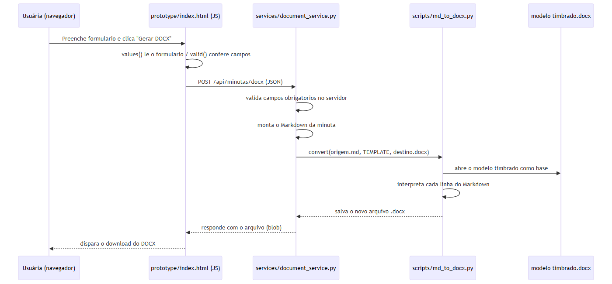

# ATA 013 — Geração de DOCX pelo próprio sistema

**Data:** 31/08/2026  
**Projeto:** Plataforma local de gestão jurídica e automação assistida  
**Referência:** ATA 012

## Decisão do contratante

Foi confirmado que o usuário não deve executar comandos no PowerShell para gerar documentos. A geração do DOCX deverá ocorrer por botão dentro do site.

## Entrega inicial

Foi criado um serviço local em `services/document_service.py`, usando a biblioteca padrão HTTP do Python. O endpoint `POST /api/minutas/docx` recebe os dados da manifestação, chama o conversor existente e devolve o arquivo DOCX.

## Limitações atuais

- O endpoint ainda não está conectado ao formulário HTML.
- Não há autenticação, aprovação, persistência ou PDF.
- O serviço escuta apenas em `127.0.0.1` para desenvolvimento.
- Dados reais não devem ser utilizados.

## Próximo passo

Conectar o botão do protótipo ao endpoint local e criar a etapa explícita de revisão/aprovação antes da conversão para PDF.

## Anexo técnico — lógica de programação e arquitetura (detalhado posteriormente)

Fluxo completo da geração de DOCX, do clique no protótipo até o download, detalhado em [`docs/logica-de-programacao.md`](../docs/logica-de-programacao.md):



Trecho de `services/document_service.py` — o endpoint criado nesta sessão:

```python
required = ("cliente", "processo", "finalidade", "fatos", "pedido")
if any(not str(payload.get(field, "")).strip() for field in required):
    self.send_error(400, "Campos obrigatórios ausentes")
    return

markdown = (f"# Manifestação simples\n\n**Cliente/parte representada:** {payload['cliente']}  \n"
            f"**Processo:** {payload['processo']}\n\n## Finalidade\n\n{payload['finalidade']}\n\n"
            f"## Fatos e informações\n\n{payload['fatos']}\n\n## Pedido ou providência\n\n{payload['pedido']}\n")
with tempfile.TemporaryDirectory(prefix="minuta-") as folder:
    base = Path(folder)
    source = base / "minuta.md"
    output = base / "manifestacao.docx"
    source.write_text(markdown, encoding="utf-8")
    convert(source, TEMPLATE, output)
    content = output.read_bytes()
```

O servidor repete a validação já feita no navegador (nunca confiar apenas no lado do cliente), monta o Markdown, e usa um diretório temporário (`tempfile.TemporaryDirectory`) para gerar e ler o DOCX sem deixar arquivos residuais em disco.
