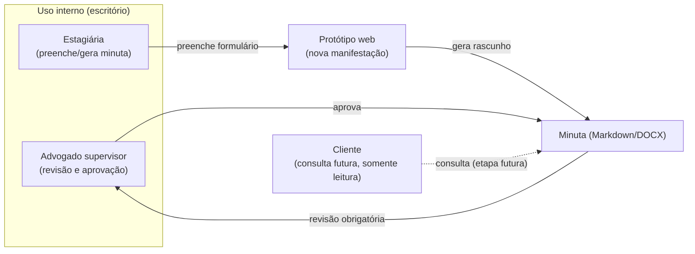

# Atores e usuários do sistema

Este documento identifica os perfis de usuário (atores) previstos para a plataforma e o que cada um pode fazer, conforme descrito em [`AGENTS.md`](../AGENTS.md). Serve de base para o controle de acesso (autenticação e perfis) mencionado nos requisitos iniciais.

## Perfis identificados

| Ator | Quem é | Acesso previsto |
|---|---|---|
| **Advogado (supervisor)** | Mauro, responsável pelo escritório e supervisor do estágio | Acesso total: cadastra clientes e processos, revisa e aprova minutas, acompanha prazos, tarefas e financeiro. |
| **Estagiária / desenvolvedora** | Giovana, responsável pelo desenvolvimento do sistema | Acesso técnico ao ambiente de desenvolvimento; no sistema em produção, acesso equivalente ao de uso interno (sem dados reais em ambiente de teste). |
| **Cliente** (previsto, não implementado) | Pessoa física ou jurídica representada pelo escritório | Acesso restrito de leitura: consulta apenas informações autorizadas do(s) seu(s) próprio(s) processo(s), pela "área do cliente" citada no `AGENTS.md`. |

## Relação entre atores e o fluxo atual do protótipo

## Observações

- No protótipo atual (`prototype/index.html`), não há login nem separação de perfis — a tela simula a visão do advogado (nome fixo "Mauro Parpinelli" na barra lateral). Autenticação e controle de perfil por usuário ainda são pendências de implementação.
- A revisão do advogado é **obrigatória** antes de qualquer uso da minuta gerada — nenhum documento produzido pelo sistema deve ser considerado final sem essa validação (ver `AGENTS.md`, regra 8).
- O acesso do cliente é a funcionalidade de menor prioridade no MVP e depende da conclusão do cadastro de processos e da autenticação de uso interno.
