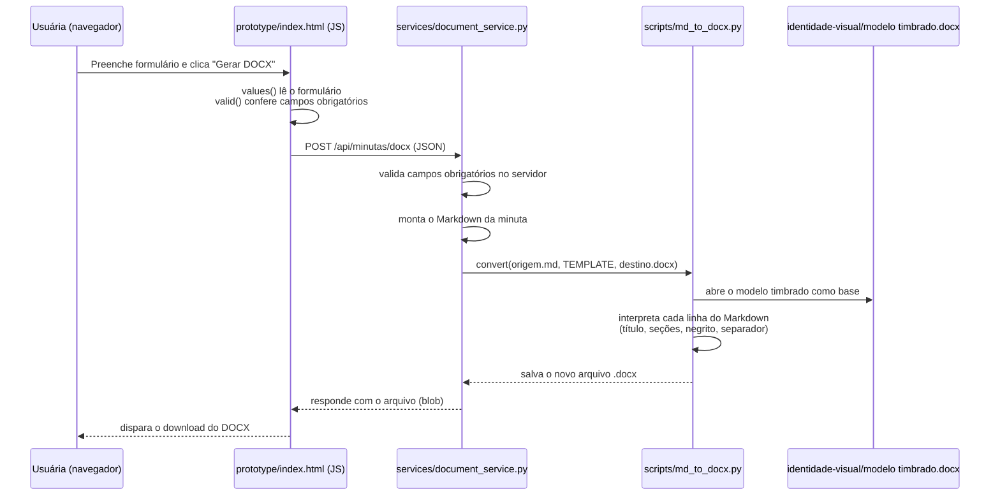

# Lógica de programação

Este documento explica, com trechos reais de código, como o protótipo gera uma minuta em DOCX a partir do formulário web. O objetivo é registrar o raciocínio técnico por trás da implementação, não apenas o resultado.

## Visão geral do fluxo



## 1. Coletar e validar os dados no navegador

Trecho de `prototype/index.html`:

```js
function values(){
  const d=new FormData(form);
  return {
    cliente:String(d.get('cliente')||'').trim(),
    processo:String(d.get('processo')||'').trim(),
    finalidade:String(d.get('finalidade')||'').trim(),
    fatos:String(d.get('fatos')||'').trim(),
    pedido:String(d.get('pedido')||'').trim()
  };
}
function valid(v){ return Object.values(v).every(Boolean); }
```

`values()` lê o `<form>` com a API `FormData` e devolve um objeto simples com os cinco campos, já removendo espaços nas pontas (`trim()`). `valid()` reaproveita esse objeto: `Object.values(v)` vira um array com os cinco valores, e `.every(Boolean)` confirma que nenhum está vazio. Essa é uma validação de **experiência do usuário** (evita uma requisição desnecessária) — não substitui a validação no servidor, que é a que realmente protege o sistema.

## 2. Enviar a minuta para o serviço local

Ainda em `prototype/index.html`, o clique em "Gerar DOCX" dispara:

```js
const response = await fetch('http://127.0.0.1:8765/api/minutas/docx', {
  method: 'POST',
  headers: {'Content-Type': 'application/json'},
  body: JSON.stringify(v)
});
```

O navegador chama um servidor **local** (roda na máquina do usuário, porta 8765) — não há nenhum serviço externo envolvido nesta etapa. Isso é intencional: nenhum dado sai da máquina do escritório para gerar a minuta.

## 3. Validar de novo e montar o Markdown no servidor

Trecho de `services/document_service.py`:

```python
required = ("cliente", "processo", "finalidade", "fatos", "pedido")
if any(not str(payload.get(field, "")).strip() for field in required):
    self.send_error(400, "Campos obrigatórios ausentes")
    return

markdown = (f"# Manifestação simples\n\n**Cliente/parte representada:** {payload['cliente']}  \n"
            f"**Processo:** {payload['processo']}\n\n## Finalidade\n\n{payload['finalidade']}\n\n"
            f"## Fatos e informações\n\n{payload['fatos']}\n\n## Pedido ou providência\n\n{payload['pedido']}\n")
```

O servidor **repete a validação** feita no navegador — princípio de segurança básico: nunca confiar apenas no que o cliente (navegador) informa, porque a requisição HTTP poderia ser forjada por qualquer ferramenta, sem passar pelo formulário. Depois, monta a mesma estrutura de Markdown que o protótipo usaria, agora no lado do servidor.

## 4. Converter o Markdown em DOCX preservando o timbre

Trecho de `scripts/md_to_docx.py`:

```python
def convert(source: Path, template: Path, destination: Path) -> None:
    document = Document(template)
    document.add_page_break()
    for line in source.read_text(encoding="utf-8-sig").splitlines():
        add_markdown_line(document, line)
    ...
    document.save(destination)
```

A função abre o **modelo timbrado** (`identidade-visual/modelo timbrado.docx`) como ponto de partida — assim, o cabeçalho, logotipo e formatação do escritório são preservados automaticamente, sem precisar recriá-los a cada minuta. Depois insere uma quebra de página e percorre o Markdown linha por linha.

```python
def add_markdown_line(document: Document, line: str) -> None:
    paragraph = document.add_paragraph()
    if line.startswith("# "):
        paragraph.style = "Title"
        paragraph.add_run(line[2:].strip())
        return
    if line.startswith("## "):
        paragraph.style = "Heading 1"
        paragraph.add_run(line[3:].strip())
        return
    ...
```

Essa função é um **interpretador simples de Markdown**: ela reconhece alguns padrões de texto (`# ` para título, `## ` para seção, `**texto**` para negrito, `> ` para itálico) e converte cada um no estilo equivalente do Word, usando a biblioteca `python-docx`. Não é um parser Markdown completo — cobre apenas os padrões que o protótipo realmente gera, o que é suficiente para o escopo atual e evita complexidade desnecessária (princípio KISS/YAGNI citado em `.github/copilot-instructions.md`).

## 5. Devolver o arquivo para download

De volta em `services/document_service.py`:

```python
self.send_header("Content-Type", "application/vnd.openxmlformats-officedocument.wordprocessingml.document")
self.send_header("Content-Disposition", 'attachment; filename="manifestacao-simples.docx"')
self.wfile.write(content)
```

O servidor devolve o arquivo `.docx` gerado diretamente na resposta HTTP, com o cabeçalho `Content-Disposition: attachment`, que instrui o navegador a baixar o arquivo em vez de tentar exibi-lo. O JavaScript do protótipo recebe esse conteúdo como um `Blob` e cria um link de download temporário (`URL.createObjectURL`).

## Decisões técnicas registradas

- **Sem framework web**: o serviço usa `http.server` (biblioteca padrão do Python), sem Flask/FastAPI — proporcional à necessidade atual de apenas um endpoint.
- **Arquivos temporários**: `document_service.py` usa `tempfile.TemporaryDirectory` para gerar o `.docx` e descartá-lo automaticamente depois de enviado — nada fica salvo em disco desnecessariamente.
- **Erros não vazam detalhes internos**: exceções inesperadas retornam uma mensagem genérica (`"Não foi possível gerar o documento"`), evitando expor detalhes internos do servidor na resposta ao navegador.
