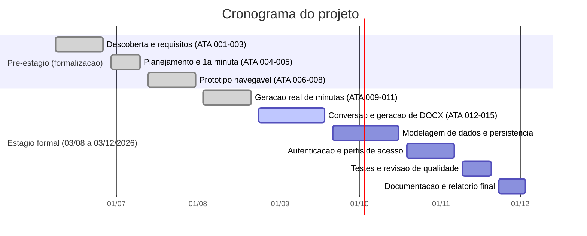
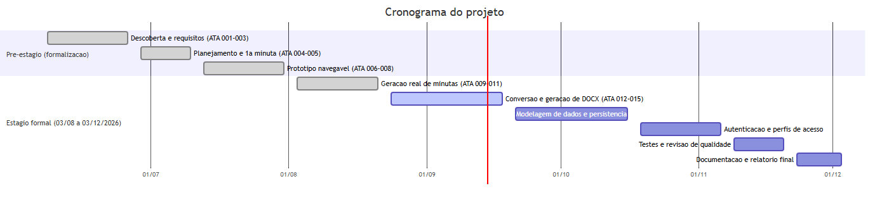

# Metodologia ágil e cronograma

## Por que uma metodologia simplificada

A equipe do projeto tem duas pessoas: o advogado supervisor (Mauro), que também atua como responsável pelo produto e revisor final, e a estagiária (Giovana), única desenvolvedora. Frameworks ágeis completos (Scrum com múltiplos papéis, cerimônias diárias, sprints fixos de 2 semanas) foram desenhados para times maiores e adicionariam processo sem agregar valor aqui. Por isso o projeto adota um **Kanban semanal simplificado**, inspirado no Scrumban, mantendo só o que é útil numa equipe pequena: visibilidade do que está em andamento e um ritmo fixo de revisão.

## Quadro de trabalho

| Coluna | Significado |
|---|---|
| **Backlog** | Ideias e pendências ainda não iniciadas (ex.: itens listados em "Próximos passos" das atas e do README). |
| **Em andamento** | O que a estagiária está desenvolvendo na semana corrente. |
| **Em revisão** | Entregue e aguardando validação do advogado supervisor. |
| **Concluído** | Aprovado e registrado em ata. |

Sugestão de ferramenta: como o projeto já está no GitHub, o próprio **GitHub Projects** (quadro Kanban integrado a Issues) pode hospedar esse board sem precisar de outra ferramenta — mas um quadro simples em texto/markdown também atende, dado o tamanho da equipe.

## Ritmo semanal

- **Toda segunda-feira** (ou terça-feira, quando a segunda é feriado): checagem do que foi concluído na semana anterior, definição do foco da semana e registro em uma nova ata (ver [`ATAS/`](../ATAS/)). Esse ritmo já é a cadência real observada nas atas do projeto — uma por semana.
- **Revisão contínua**: como o advogado supervisor participa das sessões, a revisão de cada entrega acontece no mesmo dia em que é apresentada, sem esperar o fim de um ciclo maior (diferente de uma sprint review tradicional).
- **Sem estimativas formais** (story points, velocity): dado o volume de trabalho e o tamanho da equipe, cada item do backlog é tratado como uma entrega única a ser concluída na semana.

## Cronograma (fases × tempo)

O cronograma une o [plano de atividades](plano-de-atividades.md) (fases de trabalho) ao [período oficial do estágio](dados-do-estagio.md) (03/08/2026 a 03/12/2026). As atas de números 001–008 (08/06 a 27/07/2026) registram uma fase **anterior ao início formal do estágio** — tratativas, levantamento de requisitos e primeiro protótipo, parte do processo de formalização descrito em [`docs/regras-estagio.md`](regras-estagio.md) — e não contam como horas do estágio em si.

> As datas de "Estágio formal" a partir de 21/09/2026 são **planejadas**, não executadas — serão ajustadas a cada ciclo semanal conforme o progresso real, e cada ajuste relevante deve ser registrado em ata.

## Critérios de "pronto" (Definition of Done)

Um item só passa para "Concluído" quando:

1. o código/funcionalidade foi testado manualmente pela estagiária;
2. o resultado foi demonstrado e aprovado pelo advogado supervisor;
3. o código foi commitado e enviado ao GitHub (`git push`);
4. a decisão/entrega foi registrada na ata da semana.
