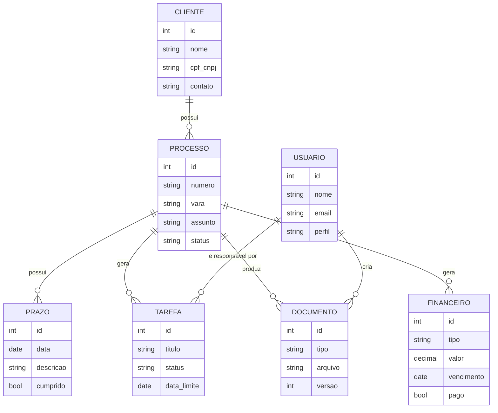

# Modelo de dados (proposto)

Este documento apresenta o modelo de dados conceitual proposto para a plataforma de gestão jurídica descrita em [`AGENTS.md`](../AGENTS.md). É um artefato de **design**, não uma implementação: o protótipo atual (`prototype/`) e os serviços locais (`services/`, `scripts/`) ainda não persistem dados em banco — eles trabalham com formulário → Markdown → DOCX, sem armazenamento permanente. Este modelo orienta a próxima etapa (persistência real) e deve ser validado com o contratante antes da implementação.

## Entidades e atributos

| Entidade | Atributos principais | Observações |
|---|---|---|
| **Usuario** | id, nome, email, perfil (`advogado`, `estagiario`, `cliente`), senha_hash, ativo | Perfil define permissões de acesso (ver [`docs/atores-e-usuarios.md`](atores-e-usuarios.md)). |
| **Cliente** | id, nome, cpf_cnpj, contato, criado_em | Pessoa física ou jurídica representada pelo escritório. |
| **Processo** | id, numero, cliente_id (FK), vara, assunto, status | Um processo pertence a um cliente. |
| **Prazo** | id, processo_id (FK), data, descricao, cumprido | Prazos processuais vinculados a um processo. |
| **Tarefa** | id, processo_id (FK), responsavel_id (FK → Usuario), titulo, status, data_limite | Trabalho interno de acompanhamento de um processo. |
| **Documento** | id, processo_id (FK), tipo, arquivo, versao, criado_por (FK → Usuario), criado_em | Minutas, peças e demais arquivos gerados ou anexados. |
| **Financeiro** | id, processo_id (FK), tipo (`honorario`, `custas`), valor, vencimento, pago | Lançamentos financeiros vinculados a um processo. |

## Relacionamentos

## Leitura do modelo

- Um **Cliente** pode ter vários **Processos**; cada Processo pertence a um único Cliente.
- Um **Processo** concentra seus **Prazos**, **Tarefas**, **Documentos** e lançamentos **Financeiros** — é a entidade central do domínio.
- Um **Usuário** (advogado ou estagiário) pode ser responsável por várias Tarefas e criar vários Documentos; o perfil `cliente` não cria registros, apenas consulta os que lhe dizem respeito (ver área do cliente em [`docs/atores-e-usuarios.md`](atores-e-usuarios.md)).

## Premissas e pendências

- Dados reais de clientes/processos não devem ser usados em desenvolvimento sem autorização e medidas de proteção (ver `AGENTS.md`, regra 7).
- O tipo de banco de dados (SQL local, conforme mencionado em `docs/respostas` das atas iniciais) ainda precisa ser confirmado tecnicamente antes da implementação.
- Este modelo cobre o MVP descrito no `AGENTS.md`; regras de negócio mais específicas (ex.: múltiplos advogados por processo, histórico de movimentações) podem exigir entidades adicionais em versões futuras.
